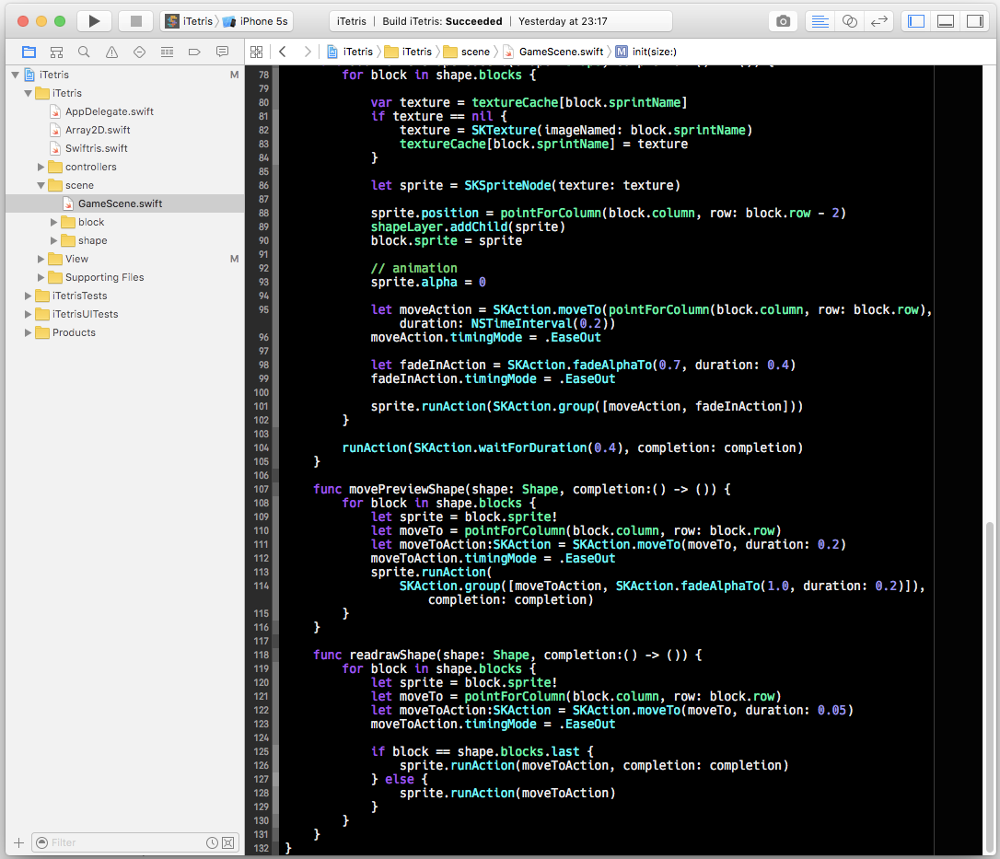

Midnight Purple Xcode Themes
===========

## Preview

## Installation

### Hack Font

If you do not have the [Hack](http://sourcefoundry.org/hack/) font installed you can get it from [GitHub](https://github.com/chrissimpkins/Hack).

### Midnight Purple Xcode Theme

1. Download & unzip.
2. In Finder, `Go > Go to Folder` and paste `~/Library/Developer/Xcode/UserData/FontAndColorThemes`, press enter.
3. Copy `Midnight Purple.dvtcolortheme` from the downloaded archive into the `FontAndColorThemes` directory.
4. Relaunch Xcode, `Xcode > Preferences...` in `Fonts & Colors` select `Midnight Purple`.
